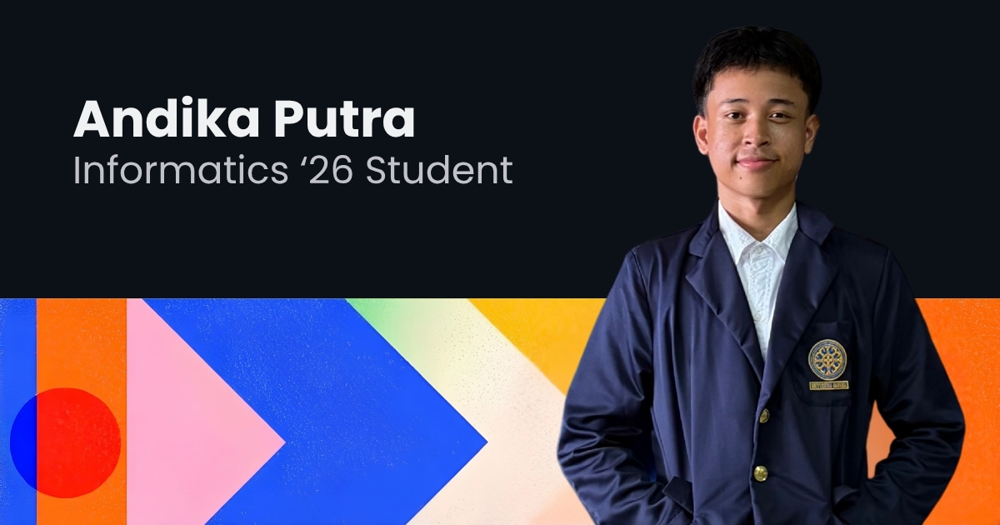

Informatics student at Udayana University &nbsp;&middot;&nbsp; currently working on OpenPOS for Indonesian SMEs

## About Me

I'm **Andika**, an Informatics student at **Udayana University** building web applications end to end, from frontend interfaces to backend systems and databases.

- Currently building **[OpenPOS](https://github.com/0xMinomus/openPOS)**, a Point of Sale system for Indonesian SMEs, now at integrated MVP stage
- Working across frontend, backend, databases, APIs, and deployment to understand the full development lifecycle
- Using AI-assisted tools to accelerate development while ensuring full code comprehension before shipping
- Focused on becoming a full-stack developer with a solid grasp of both application development and the systems behind it

## Tech Stack

             

## Featured Projects

<table align="center">
  <tr>
    <td width="50%" style="background:#0a0a0a;border-radius:14px;padding:20px;">
      
// PROJECT 01

      
<a href="https://github.com/0xMinomus/openPOS" style="color:#ffffff;">OpenPOS</a>

      
Point of Sale for Indonesian SMEs. Covers authentication, cashier POS, product and inventory management, transactions and refunds, reports, user management, and role-based access, all connected to a Go backend. Frontend and backend are fully integrated at MVP stage.

      
React &middot; TypeScript &middot; Go/chi &middot; PostgreSQL &middot; JWT

    </td>
    <td width="50%" style="background:#0a0a0a;border-radius:14px;padding:20px;">
      
// PROJECT 02

      
<a href="https://github.com/0xMinomus/OhMyFlow" style="color:#ffffff;">OhMyFlow</a>

      
An offline AI photo culler for Windows. It sorts thousands of photos into Picks, Maybe, and Rejects in minutes, then exports the ratings as XMP straight into Lightroom. Everything runs on your own machine, no cloud, no subscription.

      
Electron &middot; React &middot; TypeScript &middot; ONNX &middot; Tailwind

    </td>
  </tr>
</table>

## GitHub Stats

  

<table align="center">
  <tr>
    <td align="center"></td>
    <td align="center"></td>
  </tr>
</table>

  

> *"I don't just want to build apps, I want to understand the systems behind them."*

## Connect With Me

  

    <a href="https://andika-portofolio-eta.vercel.app/" style="color:#ffffff;">portfolio</a>
    &nbsp;&middot;&nbsp;
    <a href="https://github.com/0xMinomus" style="color:#ffffff;">github</a>
    &nbsp;&middot;&nbsp; always open to discussing projects and ideas
  

  &copy; 2026 Andika Putra. Built with curiosity, one commit at a time.

